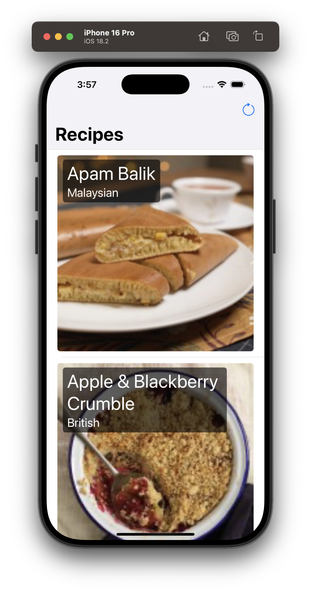
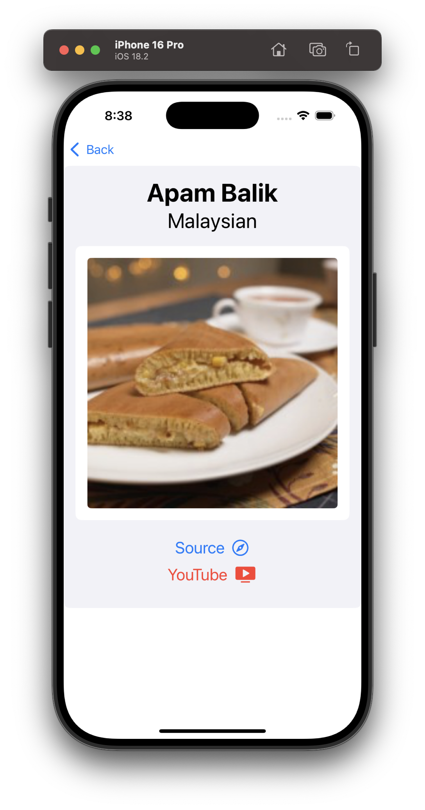

# Recipe-Fetch
### Summary: Include screen shots or a video of your app highlighting its features

 

### Summary:

### **Recipe App - Key Features & Requirements**  

🔹 **Single-Screen UI**: Display a list of recipes with name, photo, and cuisine type using SwiftUI.  
🔹 **Asynchronous Operations**: Leverage Swift Concurrency (`async/await`) for API calls and image loading.  
🔹 **Manual Image Caching**: Implement disk caching to minimize redundant network requests—no third-party libraries.  
🔹 **Efficient Networking**: Load images only when needed to optimize bandwidth usage.  
🔹 **User-Initiated Refresh**: Enable users to manually refresh the recipe list for updated content.  
🔹 **Apple-Only Frameworks**: No external dependencies for networking, caching, or testing.  
🔹 **Unit Testing**: Focus on testing core logic like data fetching and caching to ensure reliability.  
🔹 **SwiftUI-Driven**: Modern UI implementation showcasing Apple’s latest UI framework.  

🚀 **Goal**: Deliver a high-performance, well-structured SwiftUI app with optimized networking, caching, and concurrency while maintaining clean architecture and testability. 

### Focus Areas: What specific areas of the project did you prioritize? Why did you choose to focus on these areas?

### **Focus Areas: Efficient Network Requests & Optimized Memory Usage**  

1️⃣ **Efficient Network Requests**:  
   - Implemented **Azync image loading** to fetch images only when needed in the UI, preventing unnecessary API calls.  
   - Used **manual disk caching** to store images, reducing redundant network requests and improving app responsiveness.  
   - Ensured **concurrent API handling** with Swift Concurrency (`async/await`) to maintain smooth performance.  

2️⃣ **Optimized Memory Usage**:  
   - Leveraged **on-demand image loading** and deallocated unused resources to prevent memory bloat.  
   - Implemented **data persistence** for caching recipes locally, reducing network dependency and improving offline performance.  
   - Used **SwiftUI's efficient rendering** mechanisms to minimize UI overhead and ensure a smooth scrolling experience.  

🔹 **Why These Priorities?**  
   These areas were critical to delivering a high-performance app that minimizes bandwidth usage, provides a seamless user experience, and adheres to best practices for Swift Concurrency and memory management. 🚀

### Time Spent: Approximately how long did you spend working on this project? How did you allocate your time?

### Trade-offs and Decisions: Did you make any significant trade-offs in your approach?

### Weakest Part of the Project: What do you think is the weakest part of your project?

### Additional Information: Is there anything else we should know? Feel free to share any insights or constraints you encountered.